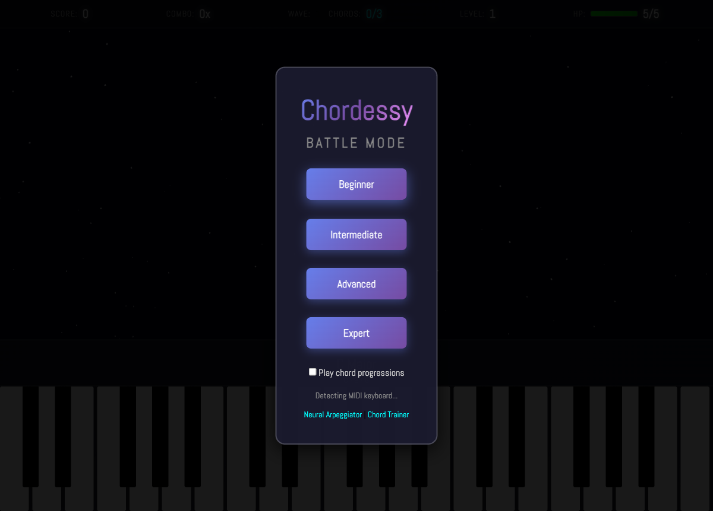
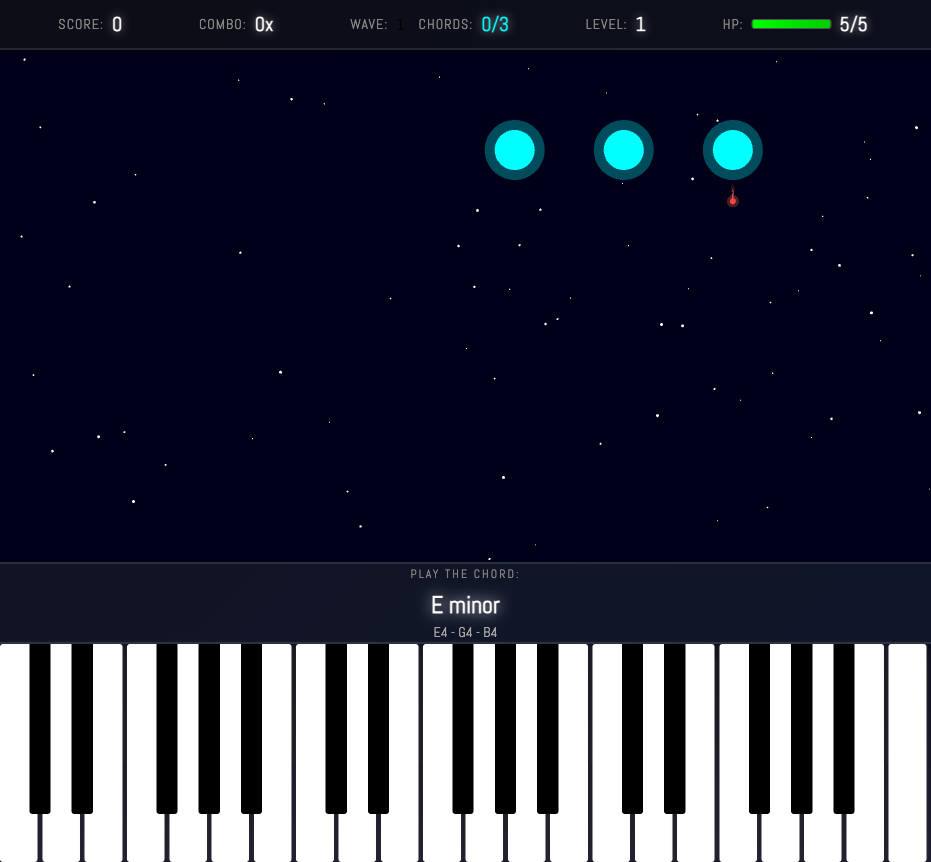

# Chordessy

A suite of browser-based music tools for learning chords and practicing piano, powered by neural networks and MIDI.



## Three Modes

### Neural Arpeggiator

Hold a note or chord and let a deep neural network play an arpeggiated pattern around it. Powered by Google Magenta's Improv RNN, TensorFlow.js, and Tone.js.

- Adjustable temperature and pattern length
- Steady pulse toggle
- MIDI controller support with input/output/clock routing

### Chord Trainer

A structured chord training game with levels that progress from basic triads through 7th chords to extended voicings. Tracks your score, streak, and accuracy as you advance through tiers.

### Battle Mode

A space-shooter meets chord practice. Enemies descend from above, each mapped to a note in the target chord. Play the correct notes on your keyboard to fire lasers and destroy them before their red bullets reach you.



**Features:**
- 4 difficulty tiers: Beginner, Intermediate, Advanced, Expert
- Chord progression mode with real progressions (Pop Classic, Jazz ii-V-I, Neo-Soul, etc.)
- Difficulty ramps each wave: bullets get faster, fire intervals shorten, grace periods decrease
- HP system with visual damage feedback (screen shake, floating damage text, explosion particles)
- Combo tracking with score multipliers
- MIDI keyboard auto-detection

## Getting Started

Serve the `neural-arpeggiator/dist/` directory with any static HTTP server:

```bash
# Using Python
python3 -m http.server 8080 -d neural-arpeggiator/dist

# Using Node
npx http-server neural-arpeggiator/dist -p 8080
```

Then open `http://localhost:8080` in your browser.

### Input

- **MIDI keyboard** (recommended): Plug in any USB MIDI controller, it will be detected automatically
- **Computer keyboard**: Use the on-screen piano keys or QWERTY mapping

## Tech Stack

- [Phaser 3](https://phaser.io/) - Game engine for Battle Mode
- [Google Magenta / TensorFlow.js](https://magenta.tensorflow.org/) - Neural network arpeggiator
- [Tone.js](https://tonejs.github.io/) - Audio synthesis and sampler
- [Web MIDI API](https://developer.mozilla.org/en-US/docs/Web/API/Web_MIDI_API) - Hardware keyboard input
- [Tonal](https://github.com/tonaljs/tonal) - Music theory utilities

## Development

```bash
npm install    # Install Jest for testing
npm test       # Run tests
```

## Credits

Neural Arpeggiator originally by [Tero Parviainen](https://codepen.io/teropa/pen/ddqEwj), using Google Magenta's pre-trained Improv RNN model.
